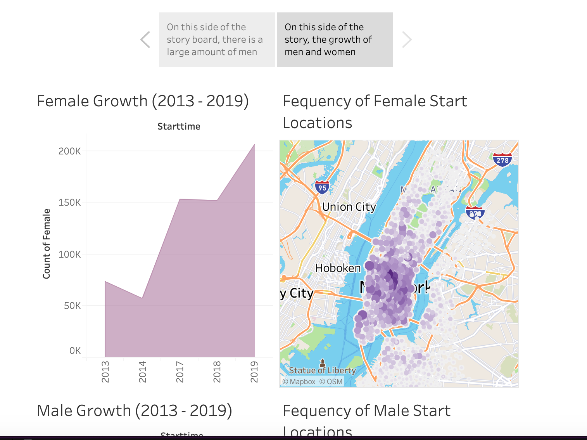
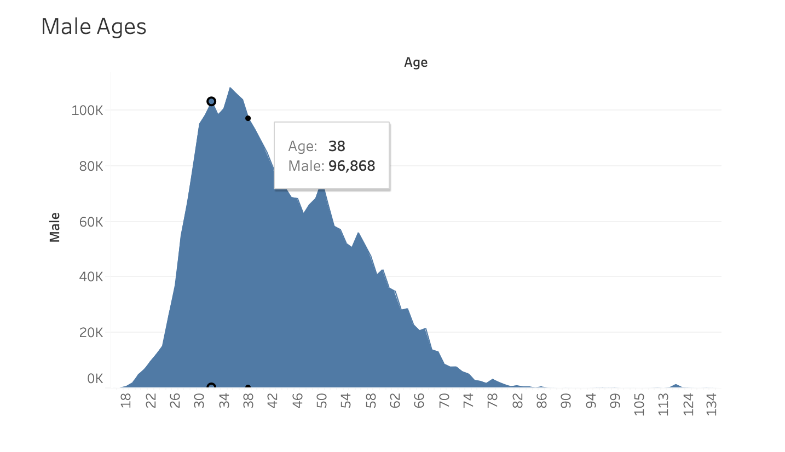

# CitiBike_Tableau_Analysis

### Instroduction
This is an evaluation/analysis of my findings for Citi Biking transportation datasets. I compared the date of births, the gender, and the growth of usage between each demographic. I gathered the data from an online source that held public CSV files for user traffic. These CSV files consisted of different types of data, such as, date of birth (DOB), Geo ordinates of bike usage, gender, date, duration of time on the bike, etc. I gathered this data to be visualized onto Tableau. I used Tableau to make sheets, stories and dashboards. The visualizations from Tableau should be located at the bottom. 

### Analysis
My analysis that I have gathered from the visualization is quite surprising. The gender data consisted ones and twos to determine which genders were which (Male 1 and Female 2). I used the combination of age, gender, location to gather my results. Based off of my data, I discovers a decrease of user between 2017 and 2018 for both males and female. However There was a similar spike of growth between 2013 and 2019 between both genders. 
	
My second finding showed large clusters of male and female users near the center region of New York city. This could be because of the need to other transportation spots, such as, metro, or bus stations. Largely populated circles are located next to high traffic areas for walkers and drivers, resulting in a large increase of Citi bikers.
	
Another phenomena was the majority of Citi bikers were in their early to mid thirties. This suggests that these users could be established business workers who benefit from this form of transpiration.

### Conclusion

I found this Citi biking dataset helpful for building visualizations using Tableau. I plan to use this same dataset to discover more trends.

